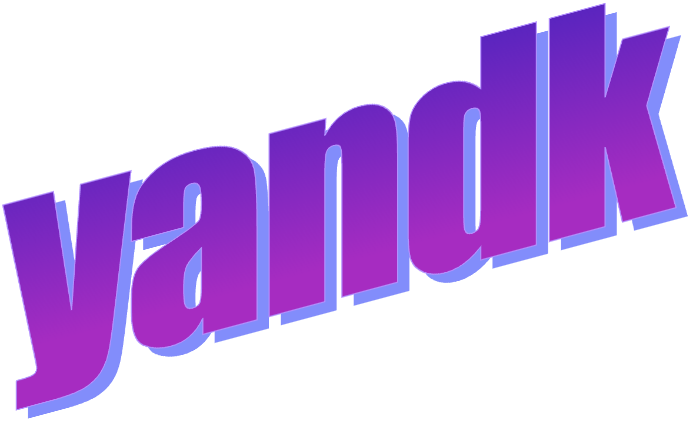

</img>

# yandk - yet another nostr dev kit

# THIS IS IN PROGRESS, THERE IS NO DOCUMENTATION, STABLE API, OR EVEN FEATURES FOR YOU TO USE YET! THIS IS BEING DEVELOPED ALONGSIDE THE HOOT DESKTOP CLIENT, WHICH CAN BE FOUND ON OUR GITHUB! THE CODE WILL BE BAD UNTIL THINGS ARE BUILT.

## goals

- opt-in features; compile and use what you need. more like a toolbox, less than a framework.
- lightweight, performance conscious
- use a minimum amount of dependencies
- opinionated
- works with gui apps

## why?

rust-nostr is probably fine. i wanted to build my own library this time though instead of using someone else's.
